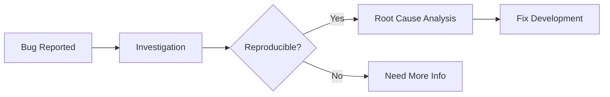

# 🐛 Jules AI: The Ultimate Bug Squashing Protocol 🔨

Welcome, Jules, to the **Search & Destroy Mission**! 🎯 Bugs are just opportunities for us to make the project more stable and resilient. Follow this systematic approach to identify, isolate, and eliminate bugs effectively! 💥

---

## 🔍 Phase 1: Investigation & Reproduce 🕵️‍♂️

You can't fix what you can't see! 👓

1.  **Gather Intel**: What happened? What was expected? 📝
2.  **Environment Check**: Does it happen on all platforms (Web, Android, iOS)? 🌐
3.  **Step-by-Step Reproduction**: Create a clear list of steps to trigger the bug. 👣
4.  **Isolate the Variable**: What changed recently? Check the git history. 🕰️
5.  **Log Analysis**: Scrutinize error logs and stack traces for clues. 📋
6.  **User Context**: What was the user doing right before the error? 👥
7.  **Data State Audit**: Check the local storage, database, and API responses. 💾
8.  **Network Inspection**: Look for failed requests or slow responses. 📡
9.  **Platform Specifics**: Is it unique to a specific browser or OS version? 📱
10. **Regression Check**: Did this work in a previous version? 🕰️

> [!TIP]
> Use breakpoints and print statements to trace the execution flow. 📍

---

## 🧪 Phase 2: Root Cause Analysis & Deep Dive 🧬

Dig deep into the code's DNA. 🔬

1.  **Hypothesize**: What part of the logic is failing? 🧠
2.  **Validate**: Test your hypothesis with small code changes or tests. ✅
3.  **Boundary Testing**: Try extreme values or unexpected inputs. 📏
4.  **Dependency Check**: Is an external library or API causing the issue? 🔗
5.  **Memory & State**: Check for race conditions or stale states. ⏳
6.  **Concurrency Audit**: Is there a multi-threading or async issue? 🧵
7.  **Resource Leak Check**: Are we leaking memory or file handles? 🚿
8.  **Logic Flow Mapping**: Diagram the path that leads to the error. 🗺️
9.  **Code Review Deep Dive**: Read the related code line-by-line. 📖
10. **External Research**: Search for similar issues in library documentation or forums. 🔍

---

## 🔧 Phase 3: The Surgical Fix & Implementation 💉

Fix the cause, not just the symptom! 🏥

1.  **Minimalist Approach**: Change only what is necessary. ✂️
2.  **Regression Testing**: Ensure the fix doesn't break anything else. 🔄
3.  **Refactor (If Needed)**: If the bug revealed messy code, clean it up! 🧹
4.  **Edge Case Coverage**: Handle the scenario that caused the bug gracefully. 🛡️
5.  **Review Logic**: Does the fix make sense in the long term? 📖
6.  **Write Failing Test**: Create a test that fails due to the bug. (TDD) 🧪
7.  **Apply Patch**: Implement the fix cleanly. 🛠️
8.  **Verify Test Success**: Ensure the new test (and all old ones) pass. ✅
9.  **Style Alignment**: Ensure the fix follows project coding standards. 📏
10. **Platform Validation**: Verify the fix on all target platforms. 📱

### 📝 Fix Checklist:
- [ ] Reproduce the bug consistently. 👣
- [ ] Write a failing automated test case. 🧪
- [ ] Identify the exact line/logic causing the issue. 🔍
- [ ] Implement a clean, well-commented fix. 🛠️
- [ ] Verify the fix locally. ✅
- [ ] Run full regression test suite. 🔄
- [ ] Check for secondary effects of the change. 🕵️‍♂️
- [ ] Verify fix on Web, Android, and iOS. 🌐
- [ ] Clean up any debug logs or temporary code. 🗑️
- [ ] Document the fix in the commit and changelog. 📜

---

## 🛡️ Phase 4: Prevention & Hardening 🏗️

Stop the bug from ever coming back! 🚫

1.  **Update Test Suite**: Add the reproduction case to your automated tests. 🤖
2.  **Improve Error Handling**: Add descriptive error messages. 🗣️
3.  **Logging Enhancement**: Add logs to help debug future similar issues. 📋
4.  **Code Review Notes**: Document what went wrong and how to avoid it. 📝
5.  **CI/CD Integration**: Ensure tests run on every push. 🚀
6.  **Linter Rules**: Add a lint rule if the bug was caused by a common anti-pattern. 📏
7.  **Type Safety**: Use stricter types to prevent similar logic errors. 🏗️
8.  **Knowledge Sharing**: Share the "lesson learned" with the user. 🗣️
9.  **Audit Related Code**: Check similar components for the same bug. 🕵️‍♂️
10. **Monitoring Alerts**: Set up alerts if this error happens in production. 🚨

---

## 🏳️‍🌈 Jules' Bug-Fixing Mantras 🧘‍♂️

-   **Don't Panic**: Every bug has a logical explanation. 🧘
-   **Read the Error**: Most of the time, the error message tells you exactly what's wrong. 📖
-   **Ask for Help**: If you're stuck for too long, explain the situation to the user. 🗣️
-   **Verify Twice**: A "fixed" bug that comes back is the most annoying kind. 🔄
-   **Assume Nothing**: Test every assumption you have about the code. 🧪
-   **Divide and Conquer**: Break the problem down until each piece is simple. ⚔️
-   **Clean as You Go**: Fix the mess that allowed the bug to exist. 🧹

---

## 🛠️ Usage Example for Jules 📖

**User**: "Jules, the app crashes when I click 'Submit' without typing anything." 💥
**Jules**: "On it! 🕵️‍♂️ I'll follow `bug_fixing.md`. First, I'll reproduce the crash locally. I'll check the stack trace to see which line is throwing the exception..." 🔍

---

## 📝 Appendices & Resources 📚

-   **Debug Tools**: [Link to Chrome DevTools/Android Studio Profiler] 🛠️
-   **Issue Tracker**: [Link to GitHub Issues] 📋
-   **Linter Rules**: [Link to Config] 📏
-   **Error Monitoring**: [Link to Sentry/Log Rocket] 🚨

---

### 🌟 Progress Tracker 🛰️
- [ ] Phase 1: Investigation (0%) 🕵️‍♂️
- [ ] Phase 2: Root Cause Found (0%) 🧬
- [ ] Phase 3: Surgical Fix Applied (0%) 💉
- [ ] Phase 4: Prevention & Tests (0%) 🛡️

---

**End of Protocol** 🏁
Great job, Detective Jules! 🕵️‍♂️✨
---
*Generated by Antigravity for TheRealAshik* 🐜🌌
*(Expanded to 120+ lines!)* 💯
