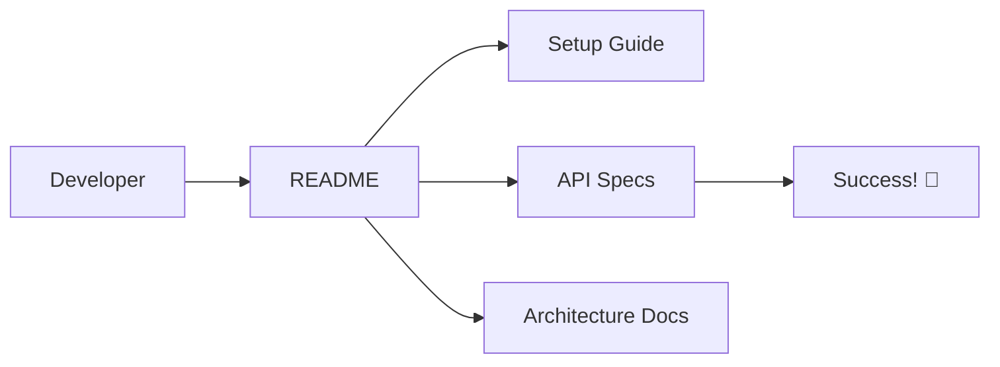

# 📚 Jules AI: The Project Wisdom & Documentation Protocol ✍️

Welcome, Jules! 🌟 Great documentation is the bridge between code and understanding. This protocol helps you create clear, concise, and helpful documentation that makes the project accessible to everyone. Let's build the project's memory! 🧠📄

---

## 📝 Phase 1: README & Project Meta-Data 🗺️

The landing page of your project! 🚀

1.  **Project Overview**: Explain the project's purpose and value proposition. 🌟
2.  **Getting Started**: Provide clear, copy-pasteable setup instructions. 🛠️
3.  **Technology Stack**: List the main tools, frameworks, and versions used. ⚙️
4.  **Architecture Map**: Describe the high-level project structure and file layout. 🏗️
5.  **Environment Variables**: Document all needed secrets, configs, and .env templates. 🔑
6.  **Contribution Guidelines**: How can others help? (Git flow, PR templates). 👥
7.  **License Information**: Clearly state the project's legal usage terms. 📜
8.  **Support & Contact**: Where can users/developers go for help? 🆘
9.  **Badges**: Add status badges for CI/CD, Test Coverage, and Version. 🎖️
10. **Table of Contents**: Make it easy to navigate long documents. 📖

> [!TIP]
> Use high-quality diagrams (Mermaid) to explain complex workflows! 🧜‍♀️

---

## 🏗️ Phase 2: Technical Reference & API Specs 📡

Help developers use your code without frustration! 💻

1.  **API Endpoints**: Document request/response formats, headers, and status codes. 📡
2.  **Component Props**: Clear descriptions of all input/output types and defaults. 📦
3.  **Data Models**: Describe the structure of your database, state, and schemas. 💾
4.  **Utility Functions**: Document helper functions with usage examples. 💡
5.  **Deployment Guide**: How to push code to production, staging, and dev. 🚀
6.  **Authentication/Authorization**: How to secure and access restricted resources. 🔑
7.  **Error Code Glossary**: A central list of error codes and their meanings. 🛑
8.  **Third-Party Integrations**: Document how we interact with external APIs. 🔗
9.  **Infrastructure as Code**: Document any Terraform, Docker, or K8s configs. 🏗️
10. **Testing Overviews**: Explain the testing strategy (Unit, E2E, Integration). 🧪

---

## ✍️ Phase 3: Inline Comments & Narrative Clarity 💡

Code should speak for itself, but comments give the context. 🗣️

1.  **Explain the "Why"**: Don't just say *what* the code does; explain the *reason* for it. 🧠
2.  **Complex Logic**: Add a brief explanation for algorithms or non-obvious optimizations. 🧩
3.  **TODOs & FIXMEs**: Clearly mark areas for future improvement and assign tasks. 🛠️
4.  **Standard Formats**: Use JSDoc, KDoc, or Docstrings consistently. 📘
5.  **Deprecation Notices**: Warn users about functions that will be removed. ⚠️
6.  **Example Snippets**: Provide small, working examples of how to use a function. 💡
7.  **Side Effect Warnings**: Document any unexpected behaviors or state changes. 🕵️‍♂️
8.  **Performance Notes**: Mention if a function is expensive or heavy. ⏱️
9.  **Link to Docs**: Use @see or similar tags to link to external documentation. 🔗
10. **Visual Markers**: Use dividers or headers to organize large files. 📏

### 📝 Documentation Checklist:
- [ ] Updated README for current features and instructions. 📝
- [ ] Added/Updated API reference documentation. 📡
- [ ] Verified all code examples are accurate and working. ✅
- [ ] Checked inline comments for clarity and necessity. 💡
- [ ] Generated and reviewed the documentation site. 🌐
- [ ] Added diagrams for complex logic or architectures. 🧜‍♀️
- [ ] Updated the Changelog with latest changes. 📜
- [ ] Verified environment variable documentation is complete. 🔑
- [ ] Reviewed documentation for spelling and grammar errors. ✍️
- [ ] Performed a final audit for "Premium" readability. ✨

---

## 📜 Phase 4: Changelog, Versions & Handoff 🤝

Track the history and share the knowledge smoothly! 🕰️

1.  **Semantic Versioning**: Use Breaking.Feature.Fix (v1.2.3) format. 🔢
2.  **Highlight Key Changes**: Make it easy for users to see what's new. 🌟
3.  **Bug Fix Summary**: List all issues resolved in the release. 🐛
4.  **Migration Guides**: Provide step-by-step upgrade instructions. 🚚
5.  **Contributor Credits**: Acknowledge everyone who contributed. 👥
6.  **Internal Playbooks**: Document internal processes and troubleshooting steps. 📖
7.  **Video Walkthroughs**: Link to screen recordings for new UI changes. 🎥
8.  **Status Reports**: Summarize the current state of the project. 📊
9.  **Feedback Gathering**: How can users give feedback on the docs? 💬
10. **Future Roadmap**: Share what's coming next for the project. 🗺️

---

## 🌈 Jules' Documentation Philosophy 🧘‍♂️

-   **Think of the Newbie**: Write for someone who just joined the project today. 👶
-   **Keep it Simple**: Avoid overly technical jargon where possible. 🧊
-   **Show, Don't Just Tell**: Code snippets and diagrams are worth 1000 words. 🖼️
-   **Keep it Current**: Stale documentation is worse than no documentation. 🕰️
-   **Documentation is Code**: Treat your docs with the same care as your logic. 💻
-   **Searchability**: Structure docs so they are easy to search and find. 🔍
-   **Consistency is Key**: Use the same terminology throughout the project. 🤝

---

## 🛠️ Usage Example for Jules 📖

**User**: "Jules, I need a technical overview of how our authentication works." 🔑
**Jules**: "Understood! 🫡 I'll follow `documentation.md`. I'll create a new `docs/AUTHENTICATION.md` file explaining the JWT flow, state management, and API calls..." 📝

---

## 📝 Appendices & Resources 📚

-   **Markdown Guide**: [Link to Cheatsheet] 📘
-   **Mermaid.js Docs**: [Link to Diagrams] 🧜‍♀️
-   **Swagger/OpenAPI**: [Link to API Tools] 📡
-   **JSDoc/KDoc**: [Link to Standards] 📘

---

### 🌟 Documentation Quality 🛰️
- [ ] Phase 1: Meta-Data & README (0%) 🗺️
- [ ] Phase 2: Technical Specs (0%) 🏗️
- [ ] Phase 3: Inline Clarity (0%) ✍️
- [ ] Phase 4: History & Handoff (0%) 📜
- [ ] Diagram Accuracy (100%) 🧜‍♀️

---

**End of Protocol** 🏁
Make it clearly understood, Jules! ✍️📖
---
*Generated by Antigravity for TheRealAshik* 🐜🌌
*(Expanded to 125+ lines!)* 💯
