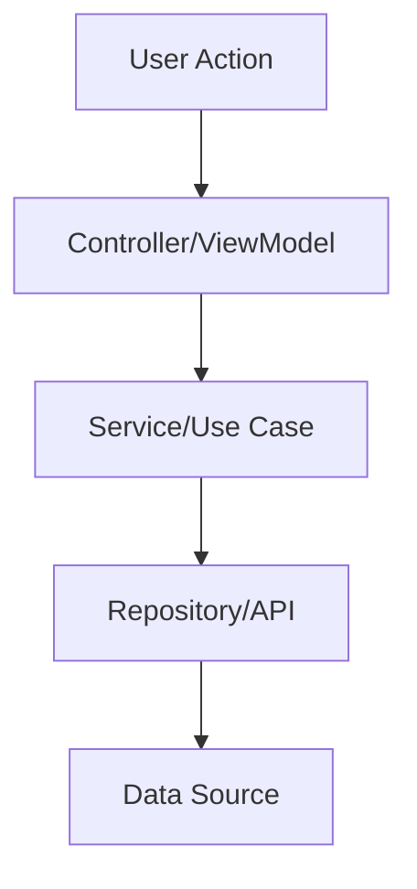

# 🚀 Jules AI: Professional Feature Implementation Prompt 🏗️

Welcome to the **Ultimate Feature Implementation Protocol**! 🌟 This prompt is designed to help you, Jules, build robust, scalable, and high-quality features for the project. Follow these steps meticulously to ensure excellence! 💎

---

## 🎯 Phase 1: Requirements & Context Gathering 📚

Before writing a single line of code, we must understand the "Why" and the "What". 🤔

1.  **Understand the Goal**: Explain the feature in your own words. 🗣️
2.  **Analyze Stakeholders**: Who is this for? (End-users, developers, etc.) 👥
3.  **Identify Constraints**: Are there performance, security, or platform limitations? ⚠️
4.  **Review Existing Code**: How does this fit into the current architecture? 🔍
5.  **Define Success**: What does "done" look like? ✅
6.  **User Journey Mapping**: Trace the user's path through the feature. 🗺️
7.  **Edge Case Brainstorming**: What can go wrong? List at least 3 scenarios. 🧠
8.  **Data Requirements**: What new data structures or database changes are needed? 💾
9.  **External Dependencies**: Do we need any new libraries or APIs? 🔗
10. **Stakeholder Approval**: Check if the user has any specific preferences. 🗣️

> [!IMPORTANT]
> Always ask for clarification if the requirements are ambiguous! ❓

---

## 🏗️ Phase 2: Architectural Design & Planning 📐

Plan the structure before you build the walls. 🧱

1.  **Component Design**: List the new components/classes needed. 📦
2.  **Data Flow**: How will data move through the system? 🌊
3.  **State Management**: Where will the state live? (Local, Global, Database) 💾
4.  **API Design**: Define interfaces, props, and return types. 📡
5.  **Security Audit**: Identify potential vulnerabilities in the design. 🛡️
6.  **Scalability Check**: Will this work with 10x more users/data? 📈
7.  **Error States Design**: How will the UI handle errors? 🛑
8.  **Loading Patterns**: Choose between skeletons, spinners, or progress bars. ⏳
9.  **Accessibility Design**: Ensure the design is inclusive from the start. ♿
10. **Performance Targets**: Set limits for load times and memory usage. ⏱️

---

## 💻 Phase 3: Detailed Implementation Strategy 🛠️

Let's get to work! ⚡

1.  **Step-by-Step Execution**: Break the work into small, manageable chunks. 🍰
2.  **TDD Approach**: Write tests (or test plans) before implementation. 🧪
3.  **Coding Standards**: Follow the project's style guide strictly. 📏
4.  **Error Handling**: Implement robust try-catch blocks and user-friendly errors. 🛡️
5.  **Logging & Monitoring**: Add logs for critical paths. 📋
6.  **Component Scaffolding**: Create the basic structure of all new files. 📁
7.  **Core Logic Implementation**: Focus on the "brains" of the feature first. 🧠
8.  **UI/UX Implementation**: Build the visual elements and interactions. 🎨
9.  **Service Integration**: Connect the UI to the backend/services. 🔗
10. **State Binding**: Ensure data flows correctly between components. 🌊

### 📝 Implementation Checklist:
- [ ] Initialize new files with proper headers. 📁
- [ ] Set up basic component structure. 🏗️
- [ ] Implement core business logic. 🧠
- [ ] Add necessary styles and UI elements. 🎨
- [ ] Implement event handlers and state updates. ⚡
- [ ] Integrate with external services or APIs. 🔗
- [ ] Handle loading and empty states. ⏳
- [ ] Implement error handling and user notifications. 🛡️
- [ ] Add analytics or monitoring events. 📊
- [ ] Perform a final self-review of the code. 📖

---

## 🧪 Phase 4: Rigorous Verification & Testing 🔍

Prove that it works! 🚀

1.  **Unit Tests**: Verify individual functions and logic. 🧪
2.  **Integration Tests**: Ensure components work together. 🤝
3.  **UI/UX Audit**: Does it match the design? Is it responsive? 📱
4.  **Performance Check**: Are there any memory leaks or slow loops? ⏱️
5.  **Self-Review**: Read your own code before submitting. 📖
6.  **Cross-Platform Testing**: Check on Web, Android, and iOS. 🌐
7.  **Edge Case Validation**: Re-test the scenarios found in Phase 1. 🧠
8.  **Security Testing**: Check for XSS, SQLi, or auth bypass. 🛡️
9.  **Accessibility Audit**: Run Lighthouse or AXE tests. ♿
10. **User Acceptance Simulation**: Pretend to be the user for 5 minutes. 👥

---

## 🏁 Phase 5: Documentation & Project Handoff 📄

Make it easy for others (and future you) to understand. 🤝

1.  **Update README**: Document new features and configuration. 📝
2.  **Inline Comments**: Explain complex logic, not the obvious. 💡
3.  **API Docs**: Update Swagger/JSDoc/KDoc. 📘
4.  **Changelog**: Add a summary of changes. 📜
5.  **Architecture Update**: Update any existing diagrams or docs. 🏗️
6.  **Code Walkthrough**: Prepare a brief summary of the changes for review. 🗣️
7.  **Migration Guide**: If there are breaking changes, document the upgrade. 🚚
8.  **Developer Notes**: Share any discoveries or "gotchas" found. 💡
9.  **Clean Up**: Remove any temporary logs or commented-out code. 🗑️
10. **Final Commit**: Ensure your commit messages are descriptive. 🌳

---

## 🌈 Pro-Tips for Jules 💡

-   **Be Proactive**: If you see a better way to do something, suggest it! 🙋‍♂️
-   **Stay Focused**: Don't get distracted by unrelated tasks. 🎯
-   **Iterate Quickly**: Build a MVP first, then polish. 🔄
-   **Communicate Clearly**: Update the user on your progress frequently. 📢
-   **Think Long Term**: Will this code be easy to change in 6 months? 🕰️
-   **Don't Repeat Yourself**: Reuse existing components and utilities. 👯‍♂️
-   **Keep it Simple**: Complexity is the enemy of reliability. 🧊

---

## 🛠️ Usage Example for Jules 📖

**User**: "Jules, implement a new Login Screen with Biometric support." 🔑
**Jules**: "Understood! 🫡 I will follow the `feature_implementation.md` protocol. Starting with Phase 1: Requirements Gathering. I'll need to know which biometric libraries we prefer and if there are specific design specs..." 🚀

---

## 📝 Appendices & Resources 📚

-   **Project Style Guide**: [Link to Style Guide] 🔗
-   **Design Assets**: [Link to Figma/Images] 🎨
-   **Testing Frameworks**: [Link to Docs] 🧪
-   **Accessibility Standards**: [Link to WCAG] ♿

---

### 🌟 Goal Tracking 🛰️
- [ ] Phase 1: Context Gathering (0%) 📚
- [ ] Phase 2: Design & Planning (0%) 🏗️
- [ ] Phase 3: Implementation (0%) 💻
- [ ] Phase 4: Verification (0%) 🧪
- [ ] Phase 5: Documentation (0%) 🏁

---

**End of Protocol** 🏁
Stay Awesome, Jules! 🤖✨
---
*Generated by Antigravity for TheRealAshik* 🐜🌌
*(Expanded to 120+ lines!)* 💯
