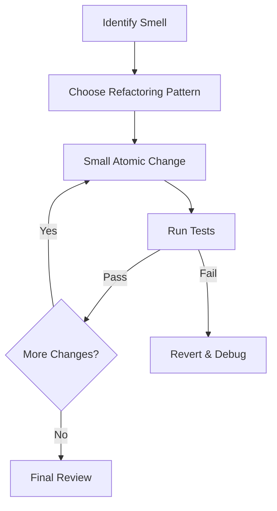

# 💎 Jules AI: The Code Elegance & Refactoring Protocol ✨

Welcome, Jules! 🌟 Maintenance is the soul of a healthy codebase. This protocol guides you through the art of **Refactoring**—improving the internal structure of code without changing its external behavior. Let's make the code shine! 💎💫

---

## 🎨 Phase 1: Identification & Code Smells 👃

Spot the mess before you clean it! 🔍

1.  **Duplicate Code**: Are we repeating ourselves (DRY)? 👯‍♂️
2.  **Long Methods/Classes**: Can we break this into smaller, focused pieces? ✂️
3.  **Complex Conditionals**: Can we simplify nested if-else blocks? 🧩
4.  **Poor Naming**: Do variables and functions clearly state their intent? 🏷️
5.  **Tight Coupling**: Are components too dependent on each other? 🔗
6.  **Feature Envy**: Is a method more interested in another class than its own? 😒
7.  **Data Clumps**: Are groups of data frequently passed together? 📦
8.  **Speculative Generality**: Are we adding code "just in case"? (YAGNI) 🔮
9.  **Message Chains**: Are we navigating deep nested objects? (Law of Demeter) ⛓️
10. **Inappropriate Intimacy**: Are classes poking too much into each other's private parts? 😳

> [!IMPORTANT]
> A "smell" isn't always a bug, but it's a sign that the code could be harder to maintain. ⚠️

---

## 🏗️ Phase 2: Refactoring Strategy & Patterns 📐

Plan your path to purity. 🗺️

1.  **Extract Method/Class**: Move logic into a new, well-named unit. 📦
2.  **Rename Symbol**: Use more descriptive and accurate names. 🖊️
3.  **Inline Variable/Method**: Simplify if the abstraction isn't needed. ➡️
4.  **Move Logic**: Put code where it logically belongs. 🚚
5.  **Introduce Design Patterns**: Use Factory, Singleton, or Observer patterns where appropriate. 🏗️
6.  **Replace Magic Numbers**: Use constants with meaningful names. 🔢
7.  **Decompose Conditional**: Break complex if-conditions into methods. 🧩
8.  **Replace Loop with Pipeline**: Use map/filter/reduce for cleaner data processing. 🌊
9.  **Pull Up/Push Down**: Move methods between parent and child classes. 🔀
10. **Encapsulate Collection**: Don't expose internal lists directly. 🛡️

---

## ⚡ Phase 3: Pure Execution & Atomic Steps 🛠️

Refactor in tiny, baby steps. 👣

1.  **Atomic Changes**: Don't change everything at once. One step at a time. ⚛️
2.  **Constant Testing**: Run your tests after *every* single change. 🧪
3.  **No New Features**: Resist the urge to add features while refactoring. 🚫
4.  **Version Control**: Commit small, meaningful steps. 🌳
5.  **Check Side Effects**: Ensure no behavior changes occurred. 🕵️‍♂️
6.  **Revert if Stuck**: If a change gets too complex, revert and try a different path. 🔙
7.  **Keep it Compileable**: The code should always be in a working state. 🏗️
8.  **Automated Refactoring**: Use IDE tools for renaming and extracting. 🤖
9.  **Manual Review**: Double-check the IDE's automated changes. 👁️
10. **Platform Consistency**: Ensure refactoring doesn't break platform-specific code. 🌐

### 📝 Refactoring Checklist:
- [ ] Verify existing tests pass before starting. 🧪
- [ ] Identify the specific target area and smell. 🎯
- [ ] Choose the appropriate refactoring pattern. 📐
- [ ] Apply the change in a small, atomic step. 🔨
- [ ] Verify functionality with automated tests. ✅
- [ ] Check for any performance regressions. ⏱️
- [ ] Repeat the process until the smell is gone. 🔄
- [ ] Perform a final self-review of the code. 📖
- [ ] Delete any unused or deprecated code. 🗑️
- [ ] Update documentation to reflect the new structure. 📜

---

## 📚 Phase 4: Readability & Maintenance 📖

Make the code a joy to read! 😊

1.  **Standardize Formatting**: Follow the project's Prettier/Lint config. 📏
2.  **Comment the 'Why'**: Explain the reasoning behind complex logic. 💡
3.  **Remove Dead Code**: Delete unused variables, functions, and imports. 🗑️
4.  **Update Related Docs**: Ensure documentation matches the new structure. 📝
5.  **Simplify Logic**: Aim for the most readable code, not the "cleverest". 🧠
6.  **Consistency Audit**: Ensure similar patterns are used throughout the module. 🤝
7.  **Dependency Visualization**: Check if the dependency graph is cleaner now. 🗺️
8.  **Performance Benchmarking**: Verify that the refactored code is still fast. ⏱️
9.  **Handoff Prep**: Document the changes for the next developer. 🗣️
10. **Final Polish**: Verify that all emojis and comments are helpful. ✨

---

## 🌈 Jules' Refactoring Philosophy 🧘‍♂️

-   **Leave it Cleaner**: Always leave the code better than you found it. 🧹
-   **Tests are your Safety Net**: Never refactor without tests. 🕸️
-   **Readability is King**: Code is read much more often than it is written. 📖
-   **Don't Over-Engineer**: Keep it as simple as possible. 🧊
-   **Boy Scout Rule**: Always check in code cleaner than you checked it out. ⛺
-   **Refactor for Change**: Refactor when you need to add a feature to messy code. 🔧
-   **Performance vs Readability**: Prioritize readability unless performance is a critical issue. ⏱️

---

## 🛠️ Usage Example for Jules 📖

**User**: "Jules, this `UserManager` class is getting too big. Can you refactor it?" 📦
**Jules**: "Understood! 🫡 I'll use `refactoring.md`. I'll start by identifying 'Long Class' and 'Feature Envy' smells. I'll extract the authentication logic into a new `AuthService`..." ✂️

---

## 📝 Appendices & Resources 📚

-   **Refactoring Guru**: [Link to Patterns] 📘
-   **Project Lint Docs**: [Link to Config] 📏
-   **Performance Benchmarking**: [Link to Tools] ⏱️
-   **Martin Fowler's Refactoring**: [Link to Book] 📖

---

### 🌟 Quality Metrics 🛰️
- [ ] Phase 1: Smell Identification (0%) 👃
- [ ] Phase 2: Strategy Planning (0%) 📐
- [ ] Phase 3: Atomic Execution (0%) ⚡
- [ ] Phase 4: Readability Audit (0%) 📚
- [ ] Test Suite Status (100% Passing) ✅

---

**End of Protocol** 🏁
Keep it clean, Jules! ✨💎
---
*Generated by Antigravity for TheRealAshik* 🐜🌌
*(Expanded to 125+ lines!)* 💯
