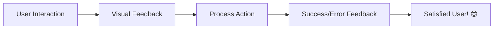

# 🎨 Jules AI: The Visual Excellence & UI/UX Protocol ✨

Welcome, Jules! 🌟 A beautiful interface is not just about looks; it's about the feel, the flow, and the accessibility. This protocol guides you through polishing the UI and UX of the project to create a "WOW" experience for our users. Let's make it premium! 💎🌈

---

## 🎨 Phase 1: Design Review & consistency Check 📏

Does it look like it belongs? 🧩

1.  **Color Palette Audit**: Are we using the predefined theme variables? (Avoid hardcoded hex codes!) 🎨
2.  **Typography Standard**: Check if font sizes, weights, and line heights follow the design system. 🖋️
3.  **Spacing & Grid Harmony**: Verify padding, margins, and alignments use the 8px grid. 📏
4.  **Component Consistency**: Ensure buttons, inputs, and cards look uniform across all pages. 🤝
5.  **Iconography Stylization**: Use a consistent icon set (e.g., Lucide, Material) and size. 🎞️
6.  **Brand Alignment**: Does the UI reflect the project's brand identity? 🏷️
7.  **Visual Hierarchy**: Are the most important elements the most prominent? 🔝
8.  **Empty State Design**: Are empty screens informative and visually pleasing? 🌫️
9.  **Image Quality**: Check if images and assets are high-resolution and optimized. 🖼️
10. **Shadow & Depth**: Use consistent shadow depths to define layers. �

> [!IMPORTANT]
> Always prioritize a "Premium" feel with subtle shadows, rounded corners, and generous whitespace. 💎

---

## ⚡ Phase 2: Micro-Animations & Interactivity 🌊

Make the app feel alive and responsive! 🦋

1.  **Hover & Active States**: Add subtle transitions when the user interacts with elements. 🖱️
2.  **Loading Skeletons**: Use beautiful animated skeletons instead of blank screens. ⏳
3.  **Visual Feedback loops**: Show immediate success/error feedback (e.g., success check, error shake). 💬
4.  **Route Transitions**: Implement smooth transitions between different views. 🎞️
5.  **Interactive Elements**: Add micro-interactions for checkboxes, toggles, and buttons. 🔘
6.  **Scroll Animations**: Add subtle effects as the user scrolls down the page. 📜
7.  **Entrance/Exit Animations**: How do elements appear and disappear? ✨
8.  **Dynamic Hover-scaling**: Slightly scale items on hover for a tactile feel. 🔍
9.  **Pull-to-Refresh Effects**: For mobile, use smooth and native-feeling animations. 🤳
10. **Performance Optimization**: Ensure animations run at 60fps without lag. ⏱️

---

## ♿ Phase 3: Accessibility & Inclusive Design 🌍

Build for everyone, everywhere! 🤝

1.  **Color Contrast Compliance**: Ensure text is readable against its background (WCAG). 👁️
2.  **Keyboard Navigation Flow**: Can users navigate the entire app with just 'Tab'? ⌨️
3.  **Semantic HTML Labels**: Use <header>, <nav>, <main>, <footer> correctly. 🏗️
4.  **Aria-Labels & Landmarks**: Add descriptive labels for screen readers. 🗣️
5.  **Font Scalability & Zoom**: Ensure the layout doesn't break when text size is increased. 🔍
6.  **Focus Visibility**: Use clear and consistent focus rings for interactive elements. ⭕
7.  **Alt Text for Images**: Provide descriptive text for all visual assets. 🖼️
8.  **Form Labeling**: Every input must have a clear and reachable label. 📝
9.  **Motion Preference**: Respect the "prefers-reduced-motion" system setting. 🛡️
10. **Touch Targets**: Ensure buttons are large enough for mobile users (min 44x44px). 🤳

### 📝 UI/UX Checklist:
- [ ] Checked responsiveness on Mobile, Tablet, and Desktop. 📱
- [ ] Verified color contrast meets accessibility standards. ♿
- [ ] Added hover, active, and focus states to all buttons. 🖱️
- [ ] Optimized image assets for fast loading. ⚡
- [ ] Self-review: Does the interface feel "Premium"? 💎
- [ ] Tested keyboard navigation path. ⌨️
- [ ] Verified aria-labels for all icons and buttons. 🗣️
- [ ] Checked for layout shifts during loading. 📏
- [ ] Ensured form validation messages are clear and helpful. 💬
- [ ] Final "WOW" factor audit. 🌟

---

## 🛠️ Phase 4: CSS Architecture & Styling Excellence 💅

Write clean, scalable, and maintainable styles! 📝

1.  **Global Design Tokens**: Define :root variables for colors, spacing, and fonts. 🏷️
2.  **BEM/Scoped Naming**: Use a consistent naming convention to avoid collisions. 📦
3.  **Avoid !important**: Use selector specificity correctly instead. 🚫
4.  **Responsive Layouts**: Use Flexbox and Grid for flexible designs. 🏗️
5.  **CSS Performance**: Avoid expensive properties (filters, large shadows) in loops. ⏱️
6.  **Media Query Management**: Organize breakpoints logically. 📱
7.  **Z-Index Management**: Use a systematic approach to layering. 📚
8.  **Vendor Prefixing**: Ensure cross-browser compatibility. 🌐
9.  **Linter Compliance**: Follow the project's CSS linting rules. 📏
10. **Post-Processing**: Use tools like Autoprefixer or PostCSS. 🤖

---

## 🌈 Jules' Design Philosophy 🧘‍♂️

-   **Less is More**: Don't clutter the screen; give elements room to breathe. 🌫️
-   **User First**: Is it intuitive? Can a new user understand it in 5 seconds? 🤔
-   **Details Matter**: A 1px border or a 0.2s transition can change everything. 📐
-   **Speed is UX**: Performance is the most important feature. ⚡
-   **Design for Delight**: Add small, unexpected touches that make users smile. 😊
-   **Consistency is Trust**: A consistent UI builds user confidence. 🤝

---

## 🛠️ Usage Example for Jules 📖

**User**: "Jules, the User Profile page feels a bit outdated. Can you polish it?" 👤
**Jules**: "Understood! 🫡 I'll follow `ui_ux_improvement.md`. I'll start by reviewing the spacing hierarchy and adding some modern micro-animations for the buttons..." 🎨

---

## 📝 Appendices & Resources 📚

-   **Color Palette Tools**: [Link to Coolors/Adobe Color] 🎨
-   **Icon Libraries**: [Link to Lucide/FontAwesome] 🎞️
-   **Performance Audits**: [Link to Lighthouse/Web Vitals] ⏱️
-   **Accessibility Guides**: [Link to WCAG 2.1] ♿
-   **Design Inspiration**: [Link to Dribbble/Behance] ✨

---

### 🌟 Aesthetics Quality 🛰️
- [ ] Phase 1: Review & Consistency (0%) 📏
- [ ] Phase 2: Interactivity & Animations (0%) ⚡
- [ ] Phase 3: Accessibility Audit (0%) ♿
- [ ] Phase 4: CSS Architecture (0%) 🛠️
- [ ] "WOW" Factor Score (Target: 10/10) 🌟

---

**End of Protocol** 🏁
Make it beautiful, Jules! ✨💎
---
*Generated by Antigravity for TheRealAshik* 🐜🌌
*(Expanded to 125+ lines!)* 💯
